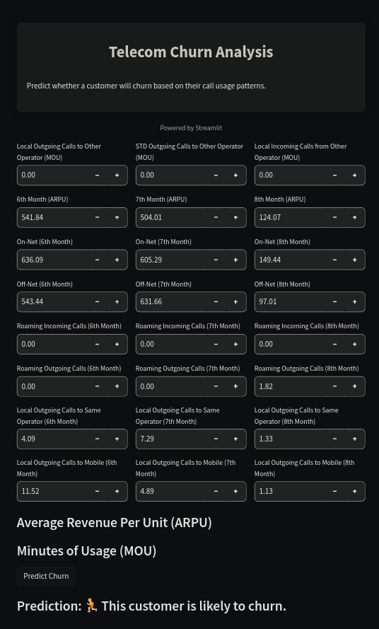

# Customer Churn Prediction Project Documentation

This project covers the entire customer churn prediction process, including data preprocessing, feature selection, model development, evaluation, and actionable insights. It enables businesses to lower churn rates and improve customer satisfaction.

- members :
  - Abhinaba Sarkar
  - Dipanjan Mahata
  - Arnab Pal 
## 1. Introduction

- `data link` : [HERE !](https://www.kaggle.com/datasets/vijaysrikanth/telecom-churn-data-set-for-the-south-asian-market)

# Run the streamlit app:

- cd into streamlit-files dir
  - ``pip install streamlit`` **install the streamlit first**
  - ``streamlit run main.py`` **run this one**
  - ``streamlit run deploy.py`` **avoid running this one**

## Table of Contents

1. [Introduction](#introduction)
2. [Data Preprocessing](#data-preprocessing)
3. [Feature Selection](#feature-selection)
4. [Model Building](#model-building)
5. [Model Evaluation](#model-evaluation)
6. [Business Recommendations](#business-recommendations)
7. [Conclusion](#conclusion)

## 1. Introduction

The primary objective of this project is to predict customer churn for a telecommunications company. Churn prediction is vital for businesses to identify customers who are likely to leave and take proactive measures to retain them.

## 2. Data Preprocessing

Data preprocessing is crucial for creating accurate and reliable predictive models.

### 2.1 Exploratory Data Analysis (EDA)

- Analyzed data distribution, statistics, and identified potential outliers.
- Explored correlations between features to understand relationships.

### 2.2 Data Cleaning

- Handled missing values through techniques like imputation or removal.
- Detected and managed duplicate records in the dataset.

### 2.3 Feature Scaling

- Applied standardization or normalization to ensure features are on the same scale.
- Used techniques like Min-Max scaling or Z-score normalization.

### 2.4 Feature Engineering

- Created new features based on domain knowledge or transformations of existing features.
- Examples: total service usage, average call duration, etc.

## 3. Feature Selection

Feature selection enhances model efficiency and interpretability.

### 3.1 Principal Component Analysis (PCA)

- Applied PCA for dimensionality reduction while retaining essential variance.
- Transformed original features into principal components.

### 3.2 Statistical Methods

- Utilized statistical tests like chi-squared or ANOVA to select features with significant impact.
- Considered p-values and domain knowledge.

### 3.3 Recursive Feature Elimination (RFE)

- Executed RFE with different models to rank and select most relevant features.
- Eliminated features with lower importance.

## 4. Model Building

Multiple machine learning models were trained to predict churn.

### 4.1 Logistic Regression with PCA

- Constructed a logistic regression model using PCA-transformed features.
- Tuned hyperparameters using techniques like GridSearchCV.
- Focused on interpretability and feature importance.

### 4.2 Support Vector Machine (SVM) with PCA

- Developed an SVM model using PCA for non-linear classification.
- Optimized hyperparameters through methods like GridSearchCV.
- Captured complex relationships between features.

### 4.3 Decision Tree with PCA

- Created a decision tree classifier with PCA-transformed features.
- Fine-tuned hyperparameters using techniques like GridSearchCV.
- Visualized the decision tree for insights.

### 4.4 Random Forest with PCA

- Built a random forest classifier incorporating PCA-transformed features.
- Tuned hyperparameters via methods like GridSearchCV.
- Leveraged ensemble learning for improved performance.

## 5. Model Evaluation

Model evaluation is crucial to gauge predictive performance.

- Utilized metrics such as accuracy, precision, recall, F1-score, and ROC-AUC.
- Employed techniques like cross-validation to assess generalization.

## 6. Business Recommendations

Insights from models drove actionable recommendations.

- Focused on strategies to retain high-risk customers during action phase.
- Designed personalized approaches based on predicted churn probabilities.
- Aligned marketing efforts with identified influential features.

## 7. Conclusion

- This project demonstrates the end-to-end process of customer churn prediction, from data preprocessing, feature selection, and model building to evaluation and business-oriented recommendations. The insights gained empower businesses to reduce churn rates and enhance customer satisfaction.
