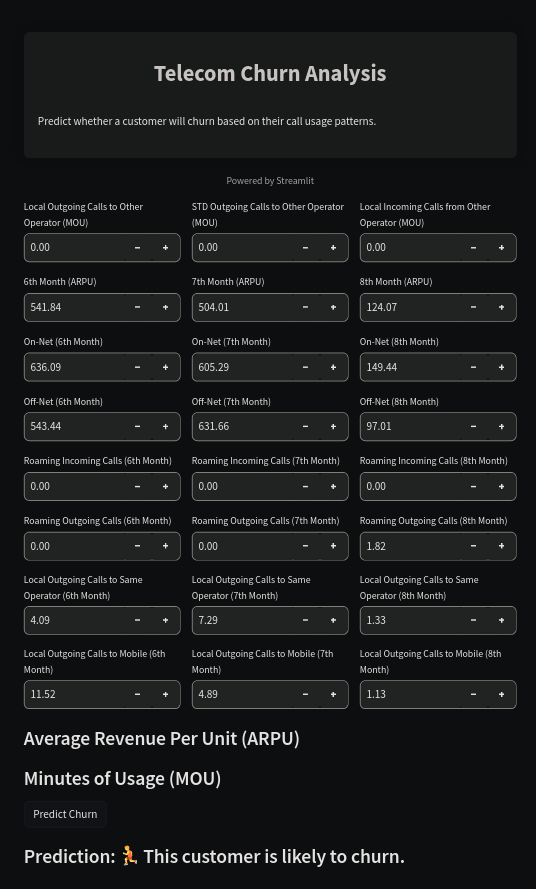

# 📡 Telecom Customer Churn Prediction

> **B.Tech Final Year Project** — Predicting customer churn for a South Asian telecom operator using machine learning, enabling proactive retention strategies.



## 👥 Team Members

- Abhinaba Sarkar
- Dipanjan Mahata
- Uttam Soren
- Arnab Pal
- Himanshu Shekhar Mete

---

## 📋 Table of Contents

- [Overview](#overview)
- [Dataset](#dataset)
- [Project Structure](#project-structure)
- [ML Pipeline](#ml-pipeline)
- [Features Used](#features-used)
- [Model Performance](#model-performance)
- [Getting Started](#getting-started)
- [Running the App](#running-the-app)
- [Business Recommendations](#business-recommendations)
- [Tech Stack](#tech-stack)

---

## Overview

Customer churn — when subscribers stop using a telecom service — is a critical business problem. Acquiring new customers costs **5–10x more** than retaining existing ones. This project builds an end-to-end machine learning pipeline to:

1. **Identify** high-value customers at risk of churning
2. **Predict** churn probability using usage patterns across 3 months
3. **Enable** targeted retention campaigns before customers leave

The model analyzes call usage, revenue, and roaming patterns across months 6, 7, and 8 (the "good" and "action" phases) to predict churn in month 9.

---

## Dataset

| Attribute | Detail |
|---|---|
| **Source** | [Kaggle — Telecom Churn Dataset (South Asian Market)](https://www.kaggle.com/datasets/vijaysrikanth/telecom-churn-data-set-for-the-south-asian-market) |
| **Records** | ~100K customers (filtered to ~30K high-value) |
| **Features** | 200+ raw columns → 24 selected features |
| **Target** | Binary — Churn (1) or No Churn (0) |
| **Churn Definition** | No calls (incoming/outgoing) and no data usage in month 9 |

---

## Project Structure

```
Btech-Final-Year-Project/
│
├── the-main-notebook.ipynb    # 📓 Complete ML pipeline (181 cells)
├── lr_model.pkl               # 🤖 Trained Logistic Regression model
│
├── MAIN-APP/                  # 🚀 Primary application (recommended)
│   ├── app.py                 # Streamlit app (main — run this)
│   ├── app-htmlCSS.py         # Streamlit app with custom HTML/CSS
│   ├── app_init.py            # Streamlit app (initial version)
│   ├── gradio-host.py         # Gradio app (shareable link)
│   ├── predict_model.pk1      # Logistic Regression classifier
│   ├── scaler.pk1             # StandardScaler (preprocessing)
│   ├── pca1.pk1               # PCA transformer
│   ├── index.html             # HTML header for styled app
│   └── styles.css             # Custom CSS styles
│
├── streamlit-files/           # 📊 Alternative Streamlit apps
│   ├── main.py                # Full-featured Streamlit app
│   └── deploy.py              # Sidebar-based Streamlit app
│
├── Front-end/                 # 🎨 Flask-ready HTML frontend
│   ├── index.html             # Bootstrap form template
│   └── style.css              # Custom styles
│
├── data/                      # 📁 Raw data
│   └── archive.zip            # Kaggle dataset (zipped)
│
├── college/                   # 📄 Documentation
│   └── final.docx             # Project report
│
└── old-notebooks/             # 📒 Earlier notebook iterations
    ├── old.ipynb
    └── old-old.ipynb
```

---

## ML Pipeline

The complete pipeline is implemented in [`the-main-notebook.ipynb`](the-main-notebook.ipynb):

```
Raw Data (100K+ records, 200+ columns)
        │
        ▼
┌─────────────────────────────┐
│   1. DATA PREPROCESSING     │
│   • Drop columns > 30%     │
│     missing values           │
│   • Remove date & constant  │
│     columns                  │
│   • Handle row-level nulls  │
│     (MOU groups by month)    │
└─────────────┬───────────────┘
              ▼
┌─────────────────────────────┐
│   2. HIGH-VALUE FILTERING   │
│   • Avg recharge (months    │
│     6+7) ≥ 70th percentile  │
│   • ~30K customers retained │
└─────────────┬───────────────┘
              ▼
┌─────────────────────────────┐
│   3. CHURN TAGGING          │
│   • Churn = 1 if month 9:   │
│     no calls + no data      │
│   • Drop month 9 columns   │
└─────────────┬───────────────┘
              ▼
┌─────────────────────────────┐
│   4. FEATURE ENGINEERING    │
│   • Derive decrease flags   │
│     (MOU, recharge, ARPU)   │
│   • Outlier capping         │
│     (10th–90th percentile)  │
│   • Select 24 key features  │
└─────────────┬───────────────┘
              ▼
┌─────────────────────────────┐
│   5. MODEL TRAINING         │
│   • Train/Test split (80/20)│
│   • SMOTE oversampling      │
│   • StandardScaler          │
│   • PCA transformation      │
│   • Logistic Regression     │
└─────────────┬───────────────┘
              ▼
         Prediction
    (Churn / Not Churn)
```

### Prediction Pipeline (at serving time)

```
User Input (24 features) → StandardScaler → PCA → Logistic Regression → Churn Prediction
```

---

## Features Used

The model uses **24 features** capturing telecom usage patterns across months 6, 7, and 8:

| Category | Features | Description |
|---|---|---|
| **Cross-Operator Calls** | `loc_og_t2o_mou`, `std_og_t2o_mou`, `loc_ic_t2o_mou` | Local/STD outgoing and incoming calls to other operators |
| **Revenue (ARPU)** | `arpu_6`, `arpu_7`, `arpu_8` | Average Revenue Per User per month |
| **On-Net Usage** | `onnet_mou_6/7/8` | Minutes of usage within the same network |
| **Off-Net Usage** | `offnet_mou_6/7/8` | Minutes of usage to other networks |
| **Roaming Incoming** | `roam_ic_mou_6/7/8` | Roaming incoming call minutes |
| **Roaming Outgoing** | `roam_og_mou_6/7/8` | Roaming outgoing call minutes |
| **Local Same Operator** | `loc_og_t2t_mou_6/7/8` | Local outgoing calls within same operator |
| **Local to Mobile** | `loc_og_t2m_mou_6/7/8` | Local outgoing calls to mobile numbers |

---

## Model Performance

| Metric | Score |
|---|---|
| **Accuracy** | 83.8% |
| **Sensitivity (Recall)** | 86.4% |
| **Specificity** | 81.2% |
| **F1 Score** | 84.2% |

> **Note:** The model prioritizes **Sensitivity (Recall)** over Accuracy — it's more important to correctly identify customers who *will* churn (even at the cost of some false positives) than to miss them.

---

## Getting Started

### Prerequisites

- Python 3.8+
- pip

### Installation

```bash
# Clone the repository
git clone https://github.com/your-username/Btech-Final-Year-Porject.git
cd Btech-Final-Year-Porject

# Install dependencies
pip install streamlit scikit-learn numpy pandas imbalanced-learn
```

For the Gradio app variant:
```bash
pip install gradio
```

---

## Running the App

### Option 1: Streamlit App (Recommended)

```bash
# Run from the MAIN-APP directory
cd MAIN-APP
streamlit run app.py
```

This launches the primary app with:
- 24 labeled input fields organized in a 3-column layout
- Full preprocessing pipeline (Scaler → PCA → Model)
- Emoji-enhanced prediction output (🏃 churn / 💰 no churn)

### Option 2: Streamlit with Custom Styling

```bash
cd MAIN-APP
streamlit run app-htmlCSS.py
```

Same functionality as Option 1, with a custom HTML header and CSS styling.

### Option 3: Streamlit (Sidebar Layout)

```bash
cd streamlit-files
streamlit run main.py
```

All 24 inputs in the main content area with section headers, loading models from `MAIN-APP/`.

### Option 4: Streamlit (Deploy — Sidebar)

```bash
cd streamlit-files
streamlit run deploy.py
```

All inputs in the sidebar with a cleaner main area for results.

### Option 5: Gradio (Shareable Link)

```bash
cd MAIN-APP
python gradio-host.py
```

Generates a shareable public URL — great for demos without deployment.

---

## Business Recommendations

Based on insights from the model and EDA:

| Insight | Action |
|---|---|
| **Decreasing recharge amount** is the strongest churn indicator | Offer targeted discounts or bonus data to customers whose recharge drops |
| **Declining MOU** signals disengagement | Proactive outreach with personalized call/data plans |
| **Low ARPU customers** churn more | Tiered loyalty programs to increase engagement |
| **Roaming users** show distinct patterns | Special roaming bundles for frequent travelers |
| **Combined decrease** in recharge + usage is a red flag | Immediate retention intervention (dedicated support, plan upgrades) |

---

## Tech Stack

| Layer | Technology |
|---|---|
| **Data Analysis** | Python, Pandas, NumPy, Matplotlib, Seaborn |
| **Machine Learning** | Scikit-learn, Imbalanced-learn (SMOTE) |
| **Model** | Logistic Regression with PCA |
| **Web App** | Streamlit, Gradio |
| **Frontend** | HTML5, CSS3, Bootstrap 4 |
| **Serialization** | Pickle |

---

## License

This project was developed as part of the B.Tech Final Year curriculum.

---

<p align="center">
  <i>Built with ❤️ for better customer retention</i>
</p>
